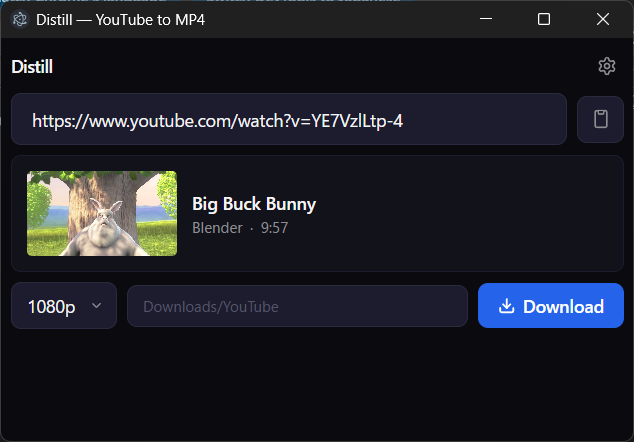
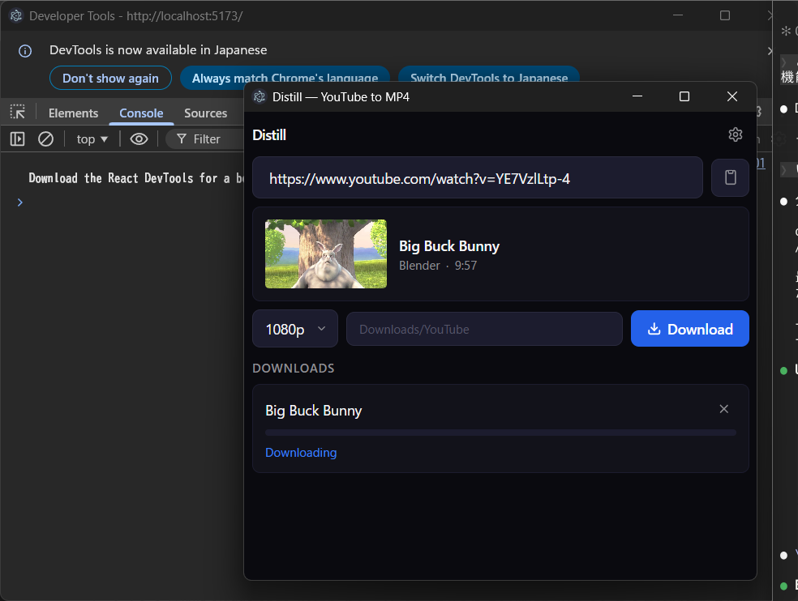
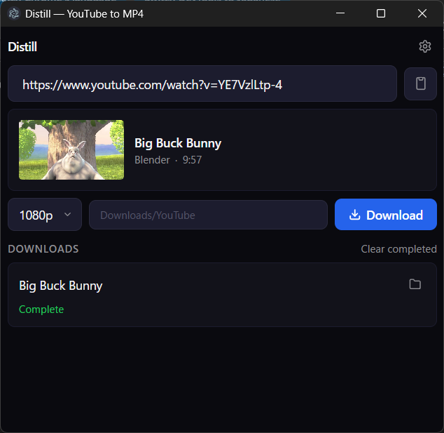

# Distill — YouTube to MP4

A desktop YouTube downloader that produces universally playable MP4 files. Built on [yt-dlp](https://github.com/yt-dlp/yt-dlp).

| Metadata | Downloading | Complete |
|----------|-------------|----------|
|  |  |  |

## Why Distill?

Most yt-dlp GUI apps download videos with **Opus audio inside MP4 containers** by default. This creates files that:

- Won't play in **Windows Media Player** (no audio)
- Won't play in **car navigation systems**
- Won't play on **some portable media players**

Distill forces **AAC (M4A) audio** on every download, guaranteeing playback on virtually any device. No configuration needed — it just works.

## Features

- **Universal playback** — AAC audio in MP4, plays everywhere
- **Auto-setup** — Downloads yt-dlp, ffmpeg, and deno automatically on first launch
- **Resolution selection** — 360p, 480p, 720p, 1080p, 1440p, 4K, Best, MP3
- **Video preview** — Shows thumbnail, title, channel, and duration before download
- **Download progress** — Real-time percentage, speed, and ETA
- **Duplicate detection** — Skips already-downloaded videos via archive tracking
- **Configurable save location** — Choose where your videos go
- **Dark theme** — Easy on the eyes
- **Compact window** — Auto-resizes as needed, stays out of your way

## Installation

### From source

Prerequisites: [Node.js](https://nodejs.org/) v18+

```bash
git clone https://github.com/shostako/ytdlp-distill.git
cd ytdlp-distill
npm install
npm start
```

On first launch, Distill will automatically download the required tools (yt-dlp, ffmpeg, deno) to `%APPDATA%/ytdlp-distill/bin/`.

### Windows installer

Coming soon.

## Usage

1. Copy a YouTube URL
2. Paste it into Distill (Ctrl+V or right-click > Paste)
3. Choose resolution (default: 1080p)
4. Click **Download**
5. The file is saved to your Downloads/YouTube folder (configurable in settings)

## How it works

Distill wraps [yt-dlp](https://github.com/yt-dlp/yt-dlp) with a format selection that prioritizes compatibility:

```
bestvideo[height<=1080][ext=mp4] + bestaudio[ext=m4a]
```

This ensures:
- **Video**: H.264 codec in MP4 container
- **Audio**: AAC codec in M4A (not Opus)
- **Output**: Standard MP4 that any player can handle

## Tech stack

| Layer | Technology |
|-------|-----------|
| Framework | Electron |
| Frontend | React + TypeScript |
| Styling | Tailwind CSS |
| State | Zustand |
| Download engine | yt-dlp |
| Media processing | ffmpeg |

## Project structure

```
src/
  main.ts                  # Electron main process
  preload.ts               # IPC bridge (contextBridge)
  renderer.tsx             # React entry point
  main/
    ytdlp.ts               # yt-dlp process management & progress parsing
    binary-manager.ts       # Auto-download & discovery of yt-dlp/ffmpeg/deno
    ipc-handlers.ts         # IPC channel handlers
    settings.ts             # Persistent settings (electron-store)
  renderer/
    App.tsx                 # Root component
    components/
      UrlInput.tsx          # URL input with clipboard support
      VideoCard.tsx         # Video metadata preview
      ResolutionPicker.tsx  # Resolution dropdown
      DownloadList.tsx      # Download queue with progress bars
      SettingsPanel.tsx     # Settings modal
      BinaryMissing.tsx     # First-time setup / tool download screen
    stores/
      download-store.ts     # Download state (Zustand)
      settings-store.ts     # Settings state (Zustand)
```

## License

[MIT](LICENSE)

## Acknowledgments

- [yt-dlp](https://github.com/yt-dlp/yt-dlp) — The engine that makes this possible
- [ffmpeg](https://ffmpeg.org/) — Media processing
- [Electron](https://www.electronjs.org/) — Desktop framework
