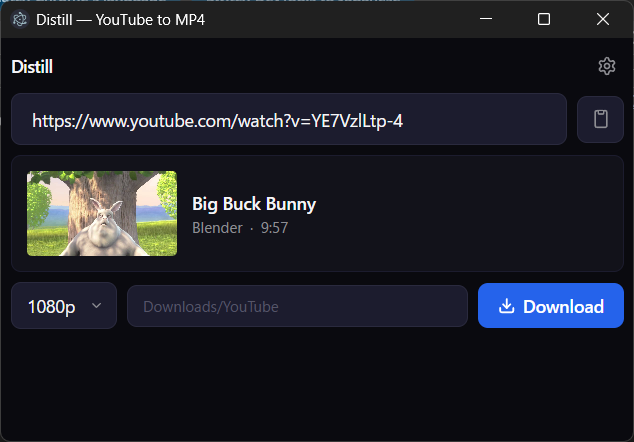
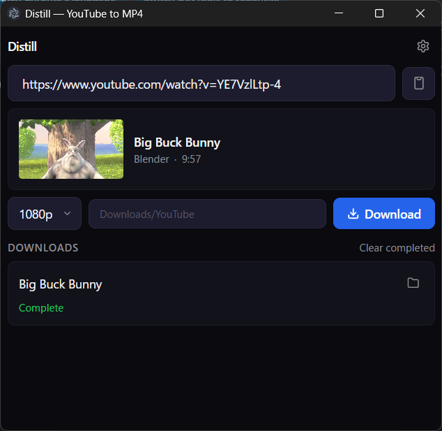
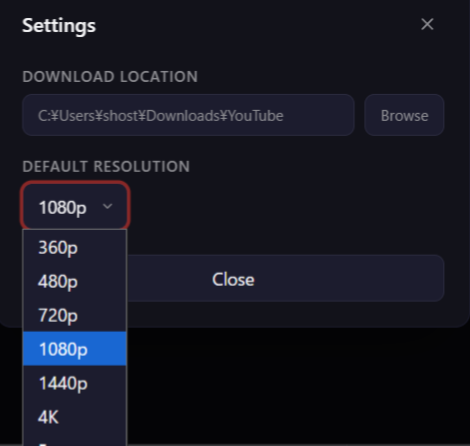

# Distill — YouTube to MP4

A desktop YouTube downloader that produces universally playable MP4 files. Built on [yt-dlp](https://github.com/yt-dlp/yt-dlp).

| Metadata | Complete |
|----------|----------|
|  |  |

## Why Distill?

Most yt-dlp GUI apps download videos with **Opus audio inside MP4 containers** by default. This creates files that:

- Won't play in **Windows Media Player** (no audio)
- Won't play in **car navigation systems**
- Won't play on **some portable media players**

Distill asks YouTube for **H.264 video and AAC audio** by name, so the default 1080p (and everything below it) plays on virtually any device. No configuration needed.

Note that selecting by container alone is not enough: `bestvideo[ext=mp4]` returns **AV1** on YouTube today, even at 1080p, and AV1 has the same playback problems on older players.

## Features

- **Universal playback** — H.264 + AAC in MP4 up to 1080p
- **Auto-setup** — Downloads yt-dlp, ffmpeg, and deno automatically on first launch
- **English / 日本語** — Language follows the OS by default; switchable in Settings without restart
- **Auto-update** — Checks yt-dlp against the latest release on every launch and replaces it when outdated (SHA256 verified). YouTube changes regularly break old yt-dlp versions; you should never have to think about it
- **Resolution selection** — 360p, 480p, 720p, 1080p, 1440p, 4K, Best, MP3
- **Video preview** — Shows thumbnail, title, channel, and duration before download
- **Download progress** — Real-time percentage, speed, and ETA
- **Duplicate detection** — Skips already-downloaded videos via archive tracking
- **Configurable save location** — Choose where your videos go
- **Dark theme** — Easy on the eyes
- **Compact window** — Auto-resizes as needed, stays out of your way

## Installation

### From source

Prerequisites: [Node.js](https://nodejs.org/) v18+

```bash
git clone https://github.com/shostako/ytdlp-distill.git
cd ytdlp-distill
npm install
npm start
```

On first launch, Distill will automatically download the required tools (yt-dlp, ffmpeg, deno) to `%APPDATA%/ytdlp-distill/bin/`.

On every later launch it compares the installed yt-dlp with the latest GitHub release and updates it if needed. The current version and a manual **Check / Update** button are in Settings. If a download ever fails with `HTTP Error 403`, that is almost always an outdated yt-dlp — update from Settings.

### Windows installer

Download `ytdlp-distill-setup.exe` from the [Releases](https://github.com/shostako/ytdlp-distill/releases) page. Run the installer — it will automatically create desktop and Start Menu shortcuts.

## Usage

1. Copy a YouTube URL
2. Paste it into Distill (Ctrl+V or right-click > Paste)
3. Choose resolution (default: 1080p)
4. Click **Download**
5. The file is saved to your Downloads/YouTube folder (configurable in settings)

Click the **gear icon** (top right) to change the default download location and resolution.



## Resolution options

| Option | Description |
|--------|-------------|
| **360p** | Low quality, smallest file size. Good for audio-focused content |
| **480p** | Standard definition |
| **720p** | HD. Good balance of quality and size |
| **1080p** | Full HD (default). Recommended for most use cases |
| **1440p** | 2K. Noticeably sharper than 1080p. AV1/VP9 video (see below) |
| **4K** | 2160p. Maximum visual quality, large files. AV1/VP9 video |
| **Best** | Highest available quality with no resolution cap. AV1/VP9 video |
| **MP3** | Audio only. Extracts audio and converts to MP3 |

360p to 1080p output MP4 with H.264 video and AAC audio. YouTube does not offer H.264 above 1080p, so **1440p, 4K and Best come as AV1 (or VP9) video** with AAC audio. They play in modern browsers and players, but not on the older devices this app is meant for; pick 1080p when compatibility matters. AAC is preferred for every option; if a video has no AAC stream at all, Distill falls back to whatever audio YouTube offers.

## How it works

Distill wraps [yt-dlp](https://github.com/yt-dlp/yt-dlp) with a format selection that names the codecs, not just the container. For 1080p:

```
bestvideo[height<=1080][vcodec^=avc1] + bestaudio[acodec^=mp4a]
```

- **Video**: H.264 (`avc1`) in an MP4 container
- **Audio**: AAC (`mp4a`), not Opus
- **Output**: Standard MP4 that any player can handle

If a video has no H.264 stream at that height, it falls back to the best MP4 video, then to any video. The full strings are in `src/main/ytdlp.ts`.

## Tech stack

| Layer | Technology |
|-------|-----------|
| Framework | Electron |
| Frontend | React + TypeScript |
| Styling | Tailwind CSS |
| State | Zustand |
| Download engine | yt-dlp |
| Media processing | ffmpeg |

## Project structure

```
src/
  main.ts                  # Electron main process
  preload.ts               # IPC bridge (contextBridge)
  renderer.tsx             # React entry point
  main/
    ytdlp.ts               # yt-dlp process management & progress parsing
    binary-manager.ts       # Auto-download & discovery of yt-dlp/ffmpeg/deno
    ipc-handlers.ts         # IPC channel handlers
    settings.ts             # Persistent settings (electron-store)
  renderer/
    App.tsx                 # Root component
    components/
      UrlInput.tsx          # URL input with clipboard support
      VideoCard.tsx         # Video metadata preview
      ResolutionPicker.tsx  # Resolution dropdown
      DownloadList.tsx      # Download queue with progress bars
      SettingsPanel.tsx     # Settings modal
      BinaryMissing.tsx     # First-time setup / tool download screen
    stores/
      download-store.ts     # Download state (Zustand)
      settings-store.ts     # Settings state (Zustand)
```

## License

[MIT](LICENSE)

## Acknowledgments

- [yt-dlp](https://github.com/yt-dlp/yt-dlp) — The engine that makes this possible
- [ffmpeg](https://ffmpeg.org/) — Media processing
- [Electron](https://www.electronjs.org/) — Desktop framework
